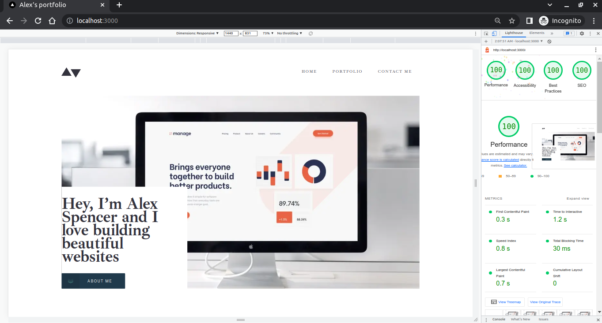
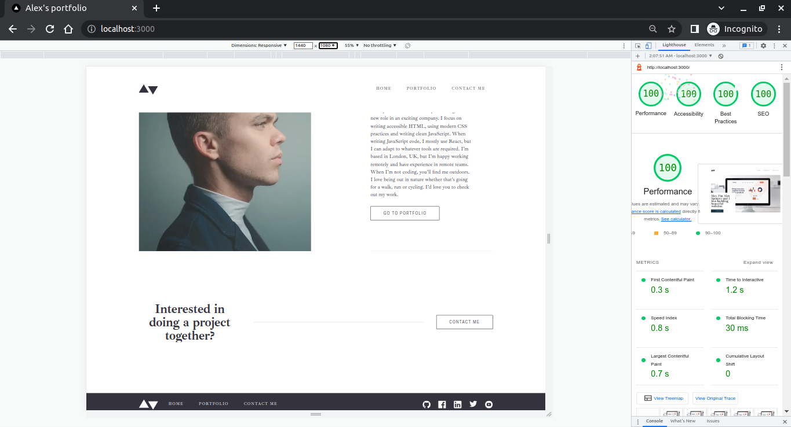
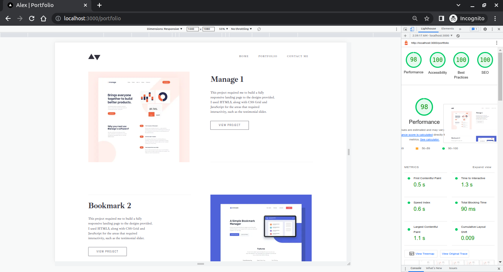

# Minimalist portfolio website

A solution to the [Minimalist portfolio website challenge on Frontend Mentor](https://www.frontendmentor.io/challenges/designo-multipage-website-G48K6rfUT).

## Table of contents

- [Screenshots](#screenshots)
- [The challenge](#the-challenge)
- [Links](#links)
- [Built with](#built-with)
- [Getting started](#getting-started)
- [Useful resources](#useful-resources)

## Screenshots








## The challenge

Users should be able to:

- View the optimal layout for each page depending on their device's screen size
- See hover states for all interactive elements throughout the site
- Click the "About Me" call-to-action on the homepage and have the screen scroll down to the next section
- Receive an error message when the contact form is submitted if:
- The Name, Email Address or Message fields are empty should show "This field is required"
- The Email Address is not formatted correctly should show "Please use a valid email address"

additional enhancement:

Frontend: 
- Awesome animations
- Stiky navigation bar
- SEO optimization

Backend:
- leveraging backend server to provide both hard-coded data and/or persist it via APIs
- adjusting helemt and cors for security
- CRUD operation over the website data (currently frontend consuming "GET" only)
- avaliable on demand contact form stored in MongoDB database (currently disabled)
- Image uploading


### Links

- Live Site URL: [designo-company-portfolio.vercel.app](https://designo-portfolio-website.vercel.app/)
- Solution URL: [www.frontendmentor.io](https://www.frontendmentor.io/solutions/designo-multi-page-website-portfolio-mfxrYwp8Wm)


## Built with

Frontned:
- Semantic HTML5 markup
- CSS
- Js
- Typescript
- Mobile-first workflow
- React - JS library
- Next.js 13 - React framework
- TawilindCss - CSS Library for styles
- Formik.js and Yup - for contact form
- Gsap - for advanced animations capability

Backend:
- Node.js - for backend environment and js backend modules
- Express.js - for running server
- MongoDB - for backend data storage
- Multer - for image uploads
- Helmet - for security protection setting againest web vulnerabilities
- Morgan - for requests logging
- and more!


## Getting started

- Clone the repository to your local machine from your terminal:

```
git clone https://github.com/KhaledMostafa990/personal-portfolio.git
```

This will create a copy of the project on your local machine.

- Navigate to the project directory:

```
cd <repo-name>
```

- Open another terminal in the project directory and do the following

```
cd frontend (in the first terminal)
cd backend (in the second terminal)
```

This will change your current working directory to the front and back end directory.

- Install the dependencies for each one:

```
npm install
```

This will install all the necessary dependencies required for running the project.

- Start the development server:

```
npm run dev
```
This will start the development server for frontend at http://localhost:3000 .
This will start the development server at http://localhost:8000 || your env.

- Setup evnironment vairables files to store your sercet values for front and back end.


Frontned:

For Mac
```
touch .env.local
```

For Win

```
echo > .env.local
```

Backend:

For Mac
```
touch config.env
```

For Win

```
echo > config.env
```

- To set up  environment variables, you'll need to gather the necessary information for as following for front and back end:

Frontend:

```
NODE_ENV=

BASE_API_URL=

APIS_PATH=

MAIN_INFO_API_PATH=

PROJECTS_API_PATH=

CONTACT_API_PATH=
```
Backend:

```
PORT= 

DB_CONNECTION_URI=

NODE_ENV=

FRONTEND_URL=

API_PATH=

MAIN_INFO_ROUTE=

PROJECTS_ROUTE=

CONTACT_ROUTE=
```


## Useful resources

- [Elzero Web School](https://www.youtube.com/@ElzeroWebSchool) - Arab developers
- [Maxmilian Academind ](https://www.youtube.com/@academind) - Javascript
- [FrontendExpert & AlgoExpert](https://www.algoexpert.io/frontend) -  frontend developers
- [Meta Frontend Developer](https://www.coursera.org/professional-certificates/meta-front-end-developer) - frontend developers
- [Dave Grey](https://www.youtube.com/@DaveGrayTeachesCode) - Typescript and node.js
- [Code with Jay](https://www.youtube.com/@DaveGrayTeachesCode) - node.js
- [Traversy Media](https://www.youtube.com/@TraversyMedia) - Javasciprt and CSS
- [Linkedin Learning](https://www.linkedin.com/learning/) - Developers
- [Next.js Documentations](https://beta.nextjs.org/docs) 
- [TailwindCSS](https://tailwindcss.com/) 
- [Gsap Documentations](https://greensock.com/docs/) 